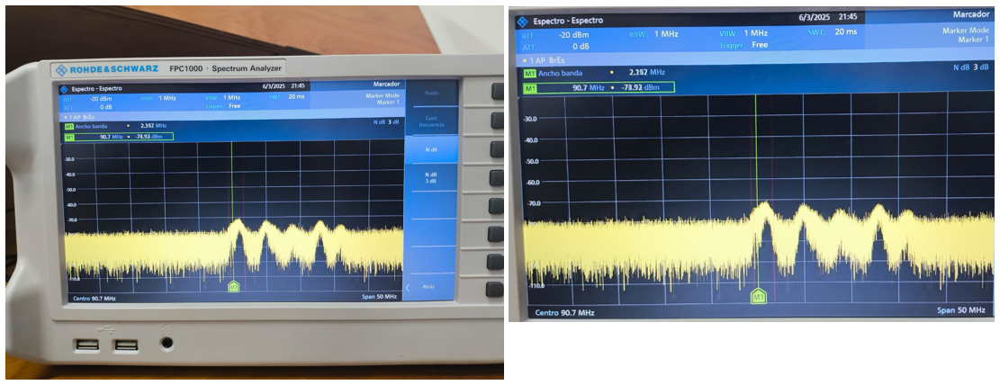

# Práctica 1C: Mediciones de potencia y frecuencia

### Integrantes
- **DANILO ALEXANDER DURÁN MEJÍA** - 2210405
  
Escuela de Ingenierías Eléctrica, Electrónica y de Telecomunicaciones  
Universidad Industrial de Santander

### Fecha
03 de Marzo de 2025

---

## Declaración de Originalidad y Responsabilidad
Los autores de este informe certifican que el contenido aquí presentado es original y ha sido elaborado de manera independiente. Se han utilizado fuentes externas únicamente como referencia y han sido debidamente citadas.

Asimismo, los autores asumen plena responsabilidad por la información contenida en este documento. 

Uso de IA:"Se utilizó ChatGPT para reformular secciones del texto, verificar gramática y automatización de código, pero el contenido técnico fue desarrollado íntegramente por los autores..

---
### Resumen

Se compararon tres señales simuladas en GNU Radio con las mediciones obtenidas en el analizador de espectros R&S FPC1000, observándose diferencias en la potencia y la presencia de un piso de ruido, el cual no estaba presente en la simulación y afectó las mediciones. Se calculó la Relación Señal a Ruido (SNR), obteniendo valores entre 36.66 dB y 56.42 dB, lo que indica señales claras pero con cierta pérdida de potencia. En la medición de una señal de radio FM a 90.7 MHz (W Radio), la baja potencia registrada (-73.92 dBm) dificultó su detección, posiblemente debido a la calidad de la antena, interferencias o pérdidas en las conexiones. La aplicación de 30 dB de ganancia en TX permitió visualizar correctamente las señales, destacando la importancia de una adecuada configuración del sistema de medición.

**Palabras clave:** SNR, Señal, Radio, Ganancia, Potencia. 

### Introducción

Esta practica abordará el uso del analizador de espectros R&S FPC1000 para medir y analizar señales generadas por GNU Radio y transmitidas a tavés del USRP 2920. Se analizarón tres tipos de señales (diente de sierra, seno y triangular) comparando caracteristicas en simulación y el analizador de espectros. Finalmente se analizó una señal de radio FM en 90.7 MHz para evaluar el impacto del piso de ruido y la calidad de la antena en la recepción de señales.

## **Procedimiento**

Durante toda la práctica, se realizaron mediciones utilizando el analizador de espectros R&S FPC1000, al cual se enviaron señales a través del USRP desde GNU Radio. Se analizaron tres tipos de señales diferentes: diente de sierra, seno y triangular. A continuación, se presentan los resultados obtenidos:

| Tipo de señal | Simulación | Analizador de espectros |
|-----------------|-----------------|-----------------------|
| Diente de sierra |  |  Potencia: Aprox. 5 dBm y Ancho de banda 1.26 MHz |
| Seno |  |  Potencia: Aprox. 15 dBm y Ancho de banda 846 KHz |
| Triangular |  |  Potencia: Aprox. 25 dBm y Ancho de banda 846 KHz |

Es posible observar diferencias notables entre las gráficas de la simulación y las obtenidas con el analizador de espectros. Una de las principales diferencias es la presencia del piso de ruido en las mediciones reales, lo cual no está presente en la simulación. Además, las señales medidas presentan una menor potencia aparente, lo que indica pérdidas en la transmisión o diferencias en la respuesta del sistema de medición.

Para analizar este efecto en detalle, se evaluó la Relación Señal a Ruido (SNR) de cada medición usándo: 

| Señal | Pseñal (dBm)                | Pruido (dBm) | SNR (dB) |
|-----------------|-----------------------| -----------------------|-----------------------|
| Diente de sierra | -48.34 | -85 | 36.66 |
| Seno  | -41.65 | -85 | 43.35 |
| Triangular | -28.58 | -85 | 56.42 |

Los valores de SNR obtenidos oscilan entre 36.66 dB y 56.42 dB, lo que indica que las señales captadas por el analizador de espectros son claras y con un nivel de ruido relativamente bajo. Al comparar las gráficas de la simulación con las mediciones, se observa que la forma de las señales es similar a pesar de las diferencias en ganancia.

Es importante destacar que, para garantizar que las señales fueran visibles en el analizador de espectros y no quedaran sumergidas en el piso de ruido, se aplicó una ganancia de transmisión (TX) de 30 dB.

Al final, un bajo SNR dificulta el rastreo de las señales transmitidas, ya que una gran parte de la señal queda mezclada con el piso de ruido, lo que reduce su claridad y puede afectar su procesamiento. Esto se evidenció durante la práctica al intentar sintonizar una estación de radio FM, específicamente 90.7 MHz (W Radio), donde se obtuvo la siguiente medición:

Como se puede apreciar en la imagen, la potencia medida en 90.7 MHz es de -73.92 dBm, un valor bastante bajo que dificulta su deteccióne impide una demodulación FM adecuada para escuchar la señal con claridad.

Esta atenuación de la potencia puede deberse a varios factores, entre ellos:
- La calidad de la antena utilizada
- Pérdidas en las conexiones
- Interferencias
- Parámetros del analizador de espectros

## **Conclusiones**

- Las gráficas obtenidas en el analizador de espectros coincidieron con las esperadas en la simulación. A pesar de la presencia de un piso de ruido, este no fue lo suficientemente alto como para opacar la señal, ya que se aplicó una ganancia de transmisión (TX) de 30 dB, lo que permitió una correcta visualización de los espectros.

- En la medición de la señal FM, se observaron ganancias bajas. Si bien el piso de ruido influyó en la calidad de la señal recibida, la principal limitación pudo haber sido la calidad de la antena utilizada, ya que se esperaba obtener una ganancia mayor. No obstante, fue posible visualizar el espectro de las estaciones de radio y sintonizar una de ellas, lo que confirma que el procedimiento de medición fue exitoso, aunque con margen de mejora en la recepción de la señal.
