# Práctica 1C: Mediciones de potencia y frecuencia

### Integrantes
- **DANILO ALEXANDER DURÁN MEJÍA** - 2210405
  
Escuela de Ingenierías Eléctrica, Electrónica y de Telecomunicaciones  
Universidad Industrial de Santander

### Fecha
03 de Marzo de 2025

---

## Actividad 1
### 3. Configuración de los Equipos
#### - USRP 2920:
#### -  Osciloscopio R&S RTB2004:

Escala horizontal: Mínimo 1 n/s y máximo 500 s

Escala vertical: Mínimo 10 mV y máximo 50 v

Mediciones verticales:

Mediciones de cuenta:

Mediciones básicas:

Mediciones horizontales:

#### -  Analizador de Espectros R&S FPC1000:

Rango de frecuencia entre 5 kHz y 1 GHz

Resolución (RBW) mínima de 1 Hz y máxima de 3kHz

Figura de ruido:

### Preguntas Orientadoras
#### 1. ¿Cuál es el rango de frecuencia del USRP 2920 y cómo se compara con el del analizador de espectros?
#### 2. ¿Qué parámetros del USRP 2920 se deben configurar para transmitir una señal en una frecuencia específica?
#### 3. ¿Cómo se configura el osciloscopio para medir la amplitud y la frecuencia de una señal?
Para medir la amplitud hacemos click en el botón de "Menu", luego en "Medida", luego seleccionamos tipo "Vertical" y damos click en el cuadro de "Amplitud".

Para medir la frecuencia hacemos click en el botón de "Menu", luego en "Medida", luego seleccionamos tipo "Básico" y damos click en el cuadro de "Frecuencia".
#### 4. ¿Qué diferencia hay entre medir una señal en el dominio del tiempo (osciloscopio) y en el dominio de la frecuencia (analizador de espectros)?
El osciloscopio me permite observar la señal tal cual es en el tiempo y poder realizar mediciones y conocer sus caracteristicas ya que puedo medir su amplitud, periodo, entre otros. Por otro lado, el analizador de espectros me permite observar cómo la energía de esa señal se distribuye a lo largo de las frecuencias permitiendome conocer el ruido y/o interferenias que se presenten en la señal.
#### 5. ¿Cómo se mide el piso de ruido en el analizador de espectros? ¿Cómo afecta la frecuencia central, SPAN y RBW la medida de piso de ruido? ¿Por qué?
El piso de ruido es el "ruido por defecto" que se puede apreciar en el analizador de espectros cúando hay ausencia de una señal de entrada tal y como se obseva en la [figura de ruido.png](https://github.com/SpikedRex/GNURADIO_LABCOMUIS_2025_1_B1C_G2/blob/main/practica_1/practica_1C/w9.PNG) presentada anteriormente. 

Cúando se tiene una frecuencia muy alta, el piso de ruido puede aumentar. Cúando el SPAN es más grande, el piso de ruido puede aumentar ya que se están incluyendo mas frecuencias por espacio. Un RBW alto puede elevar el piso de ruido debido a que más energía se acumula.

---

## Actividad 2
### 1. Iniciar GNU Radio
##### Configure la frecuencia de muestreo (samp_rate) en 20 kHz
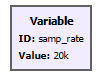

### 2. Ejecutar el Flujograma:
##### Identifique y relacione los bloques presentes en el flujograma con lo observado en la ventana de ejecución.

| Variable | Ventana Ejecución                | Bloque flujograma |
|-----------------|-----------------------| -----------------------|
| Source Type |  | 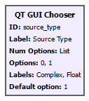 |
| Waveform | 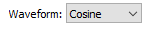 | 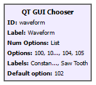 |
| Amplitude | 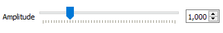 | 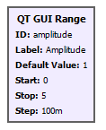 |
| Frecuency in Hz | 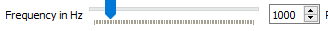 | 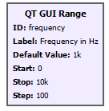 |
| Offset | 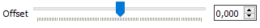 | 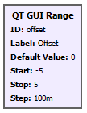 |
| Phase Rad | 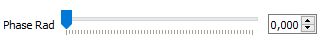 |  |
| Noise Voltage | 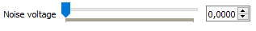 | 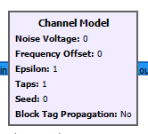 |
| Carrier Frecuency in MHz | 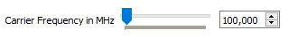 | 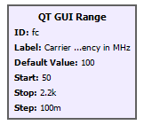 |
| Tx gain in dB | 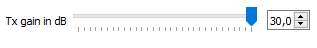 | 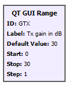 |

### 3. Análisis de Señales:
##### Analice y valide los resultados en el dominio del tiempo y de frecuencia si se modifica
- El tipo de dato de la fuente (compleja o flotante)

  | 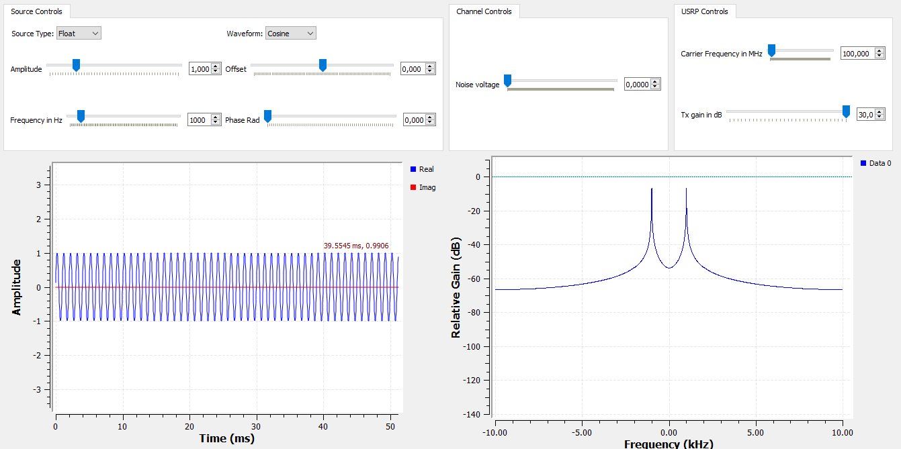            | 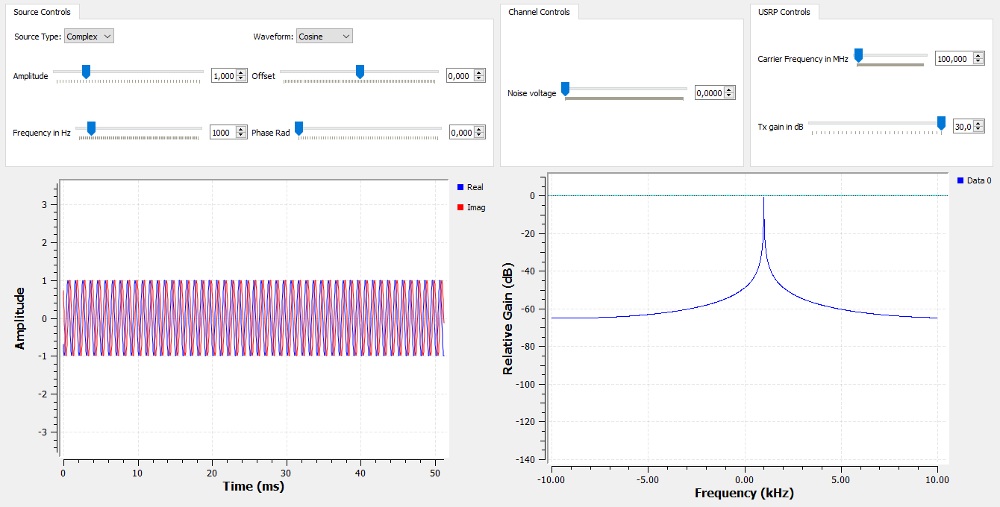                 |
  |-----------------|-----------------------|
  
- La forma de onda

  | 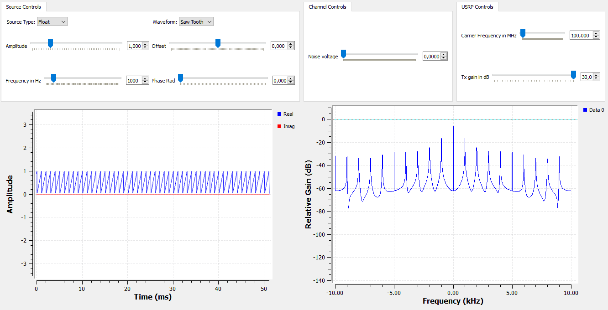            | 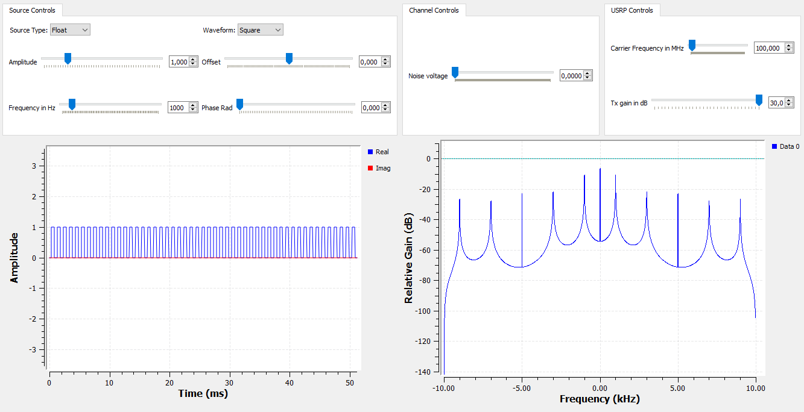                 |
  |-----------------|-----------------------|
  
- La frecuencia y fase de la señal

  |             | 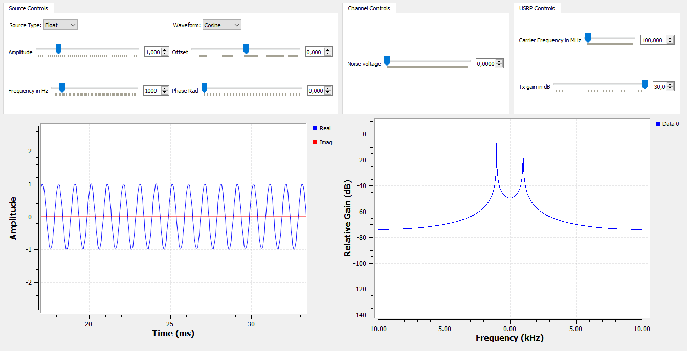                 |
  |-----------------|-----------------------|
  
- Efectos de modificar la amplitud de la señal generada.
  
  | 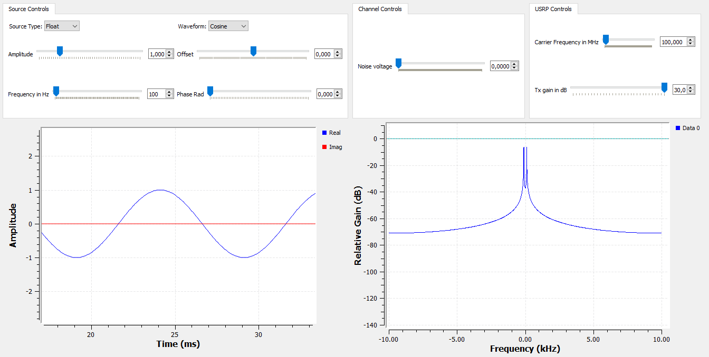            | 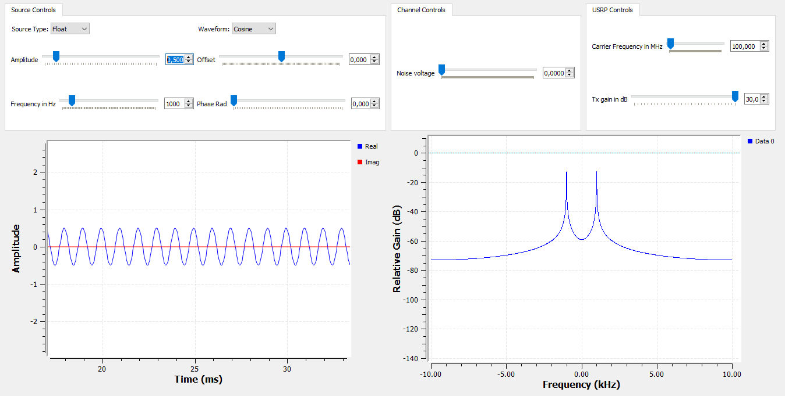                 |
  |-----------------|-----------------------|
---

## Actividad 3
### 1. Configurar el USRP 2920:
##### Identifique el bloque de frecuencia de muestreo (samp_rate) y observe el efecto de cambiar su valor (e.g. 10 kHz).

##### Configure la frecuencia de muestreo (samp_rate) en 1 MHz.

Es posible apreciar que al aumentar el samp_rate, esos dos picos que aparecían a 10 KHz "Desaparecen" (en realidad se hacen muy pequeños) esto debido a que muestrear con una frecuencia más alta, la resolución espectral aumenta permitiendo tener más información de más frecuencias.

##### Verifique el efecto de modificar la frecuencia y ganancia del USRP.

No se aprecian efectos en la simulación al modificar dichos parámetros.

### 2. Medición con el Analizador de Espectros:
##### Mida el piso de ruido normalizado a la frecuencia de portadora que va a utilizar.
El piso de ruido a una frecuencia portadora de 500 MHz es de aproximadamente -95 dBm

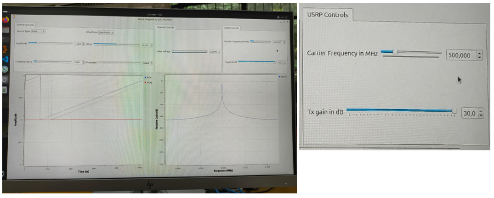
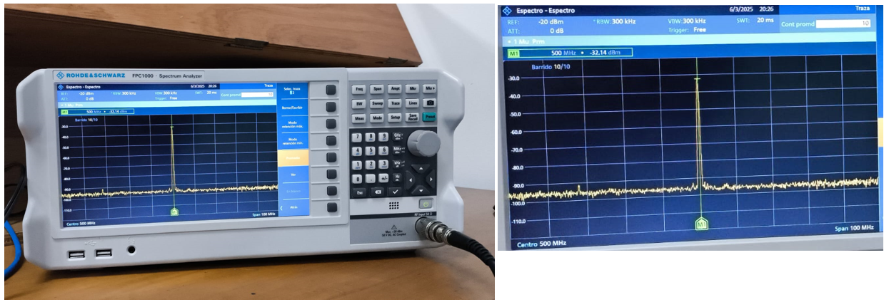

##### Compare el espectro de la señal observada en el analizador de espectros con la observada en la pantalla de simulación.

| Simulación | Analizador de espectros |
|-----------------|-----------------------|
| 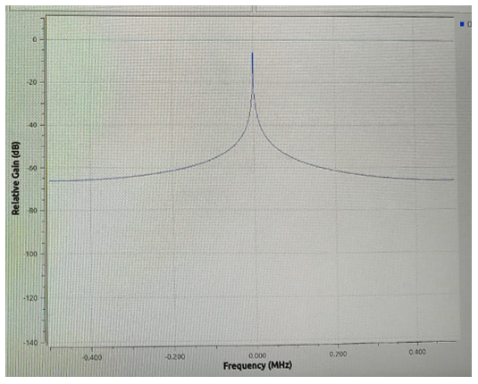            |                  |
| Ganacia: Aprox. 55 dB = $$\text{55} - 10\log_{10}\left(\frac{1\text{mW}}{1\text{W}}\right)$$ = Aprox. 85 dBm | Ganancia: Aporx. 60 dBm |

Es posible apreciar que la señal observada en el analizador de espectros es muy similar en forma y frecuencia central con respecto a la simulación (500 MHz) sin embargo, se presenta una caída en la ganancia de aproximadamente 15 dBm  debido a un posible ruido que aparece duránte la transmisión muy posiblemente al hardware del USRP y la calidad del cable de conexión, ademas, este último puede generar atenuaciones duránte la transmisión provocando caídas de ganancia.

##### Compare el espectro de la señal observada en el analizador de espectros con la observada en la pantalla de simulación.Analice y valide los resultados en el dominio de la frecuencia si se modifica:
- El tipo de dato de la fuente (compleja o flotante)

  | 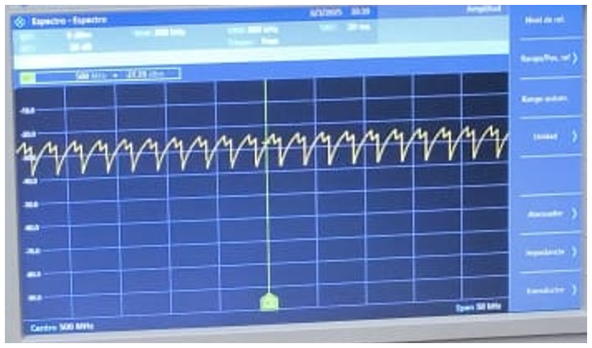            | 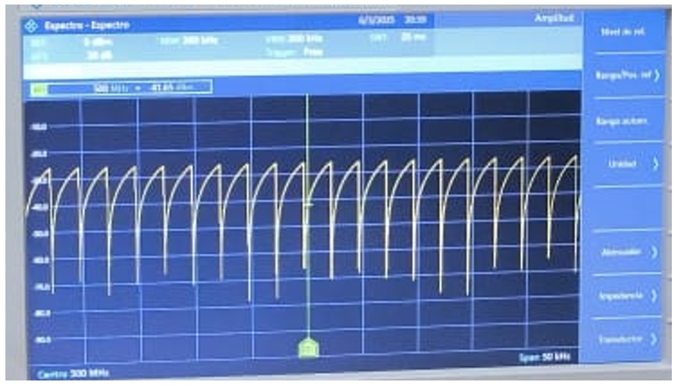                 |
  |-----------------|-----------------------|
  
- La forma de onda

  | 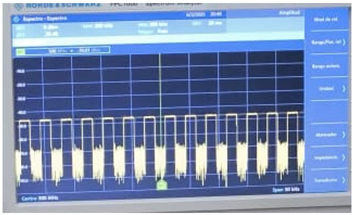            | 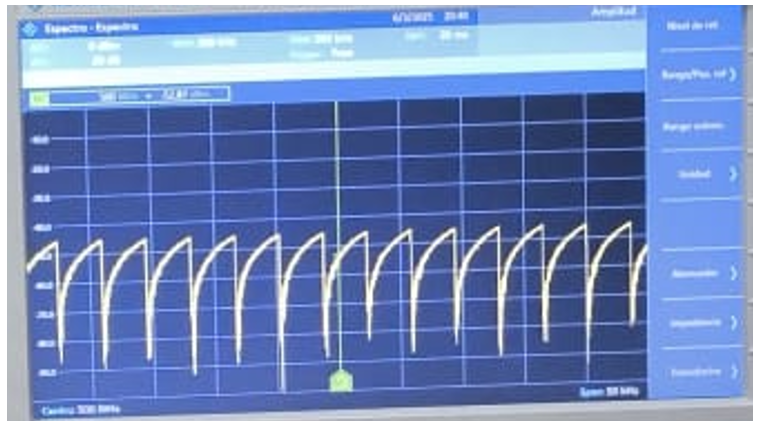                 |
  |-----------------|-----------------------|
  
- La frecuencia y fase de la señal

  | 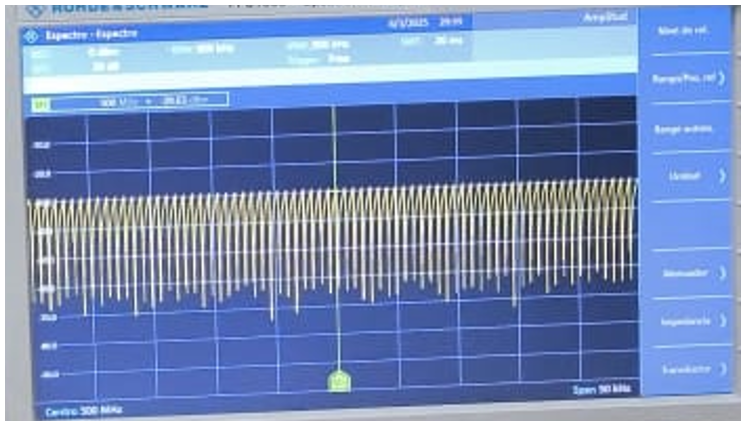            | 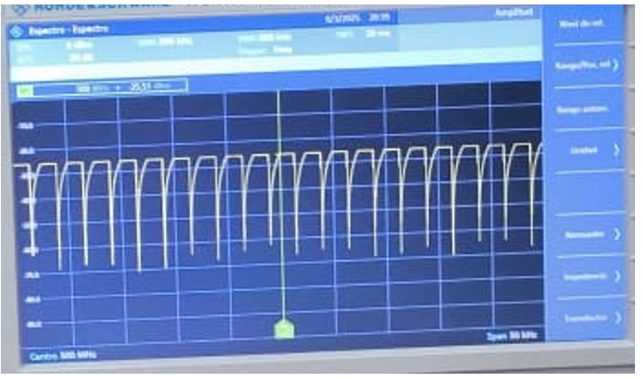                 |
  |-----------------|-----------------------|
  
- Efectos de modificar la amplitud de la señal generada.
  
  | 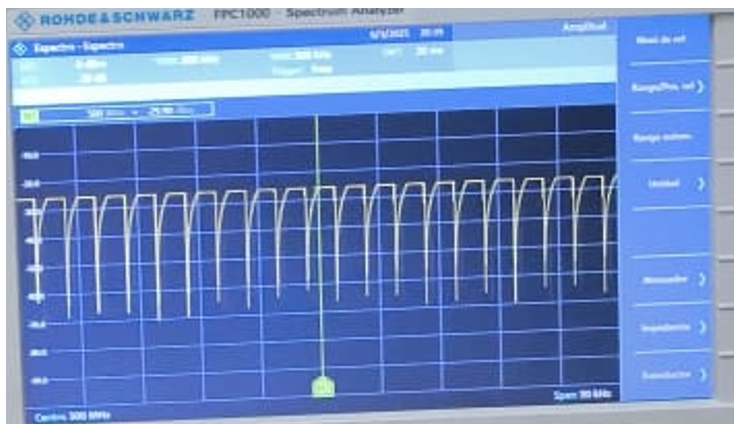            | 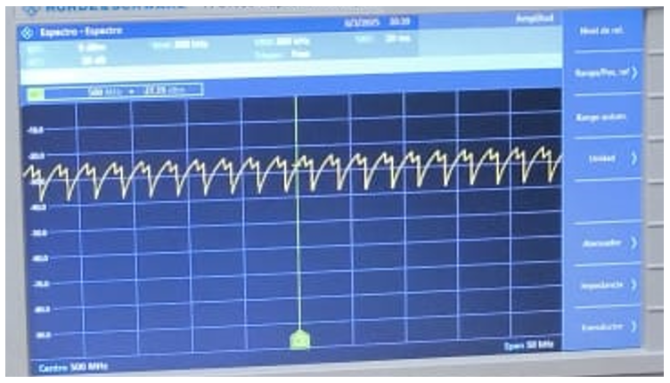                 |
  |-----------------|-----------------------|

##### Mida potencia de la señal transmitida y ancho de banda de diferentes señales generadas.

| Tipo de señal | Simulación | Analizador de espectros |
|-----------------|-----------------|-----------------------|
| Diente de sierra | 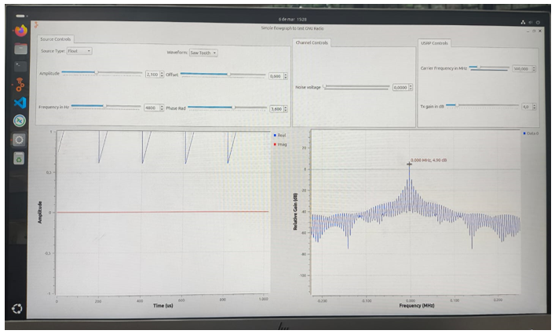            | 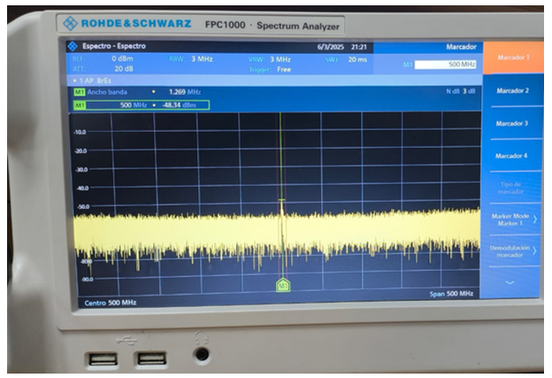 Potencia: Aprox. 5 dBm y Ancho de banda 1.26 MHz                |
| Seno | 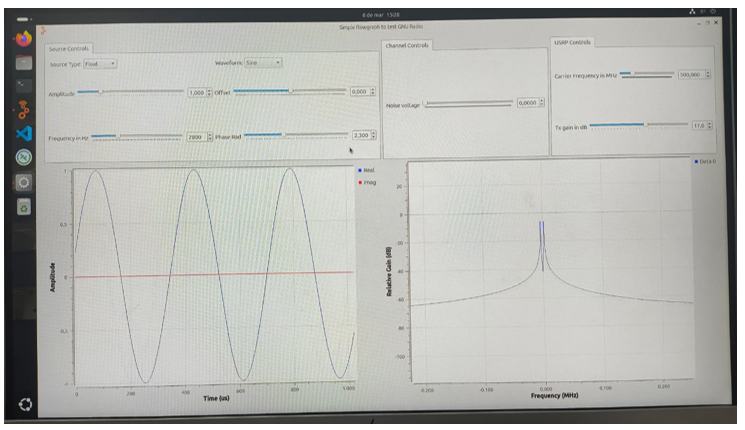            |  Potencia: Aprox. 15 dBm y Ancho de banda 846 KHz                |
| Triangular | 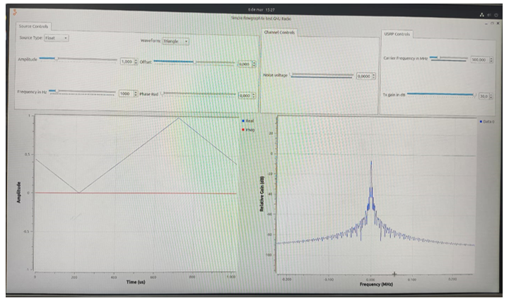            | 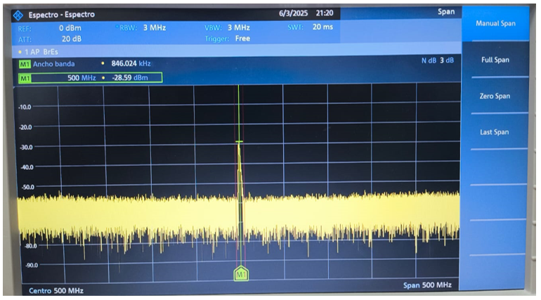 Potencia: Aprox. 25 dBm y Ancho de banda 846 KHz                |

##### Conecte una antena apropiada a la entrada del analizador de espectros y observe el espectro de una señal FM (las estaciones FM se sitúan entre los 88 MHz y 108 MHz). Mida su ancho de banda y relación señal a ruido. 

Se eligió la señal a 90.7 MHz (W Radio):
- Ancho de banda: 2.2 MHz
- Relación señal a ruido (SNR):  = -73.92-(-85) = 11.08 dB
  
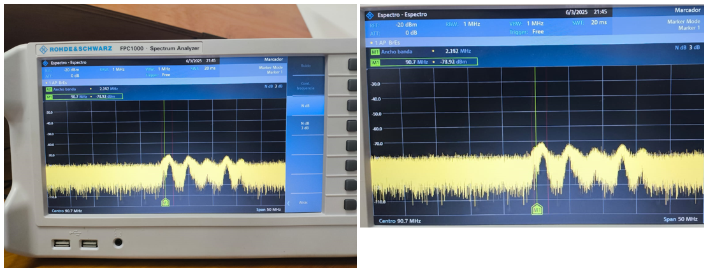

[![🔊 Vista la señal a 90.7 MHz (W Radio)]](https://github.com/SpikedRex/GNURADIO_LABCOMUIS_2025_1_B1C_G2/blob/main/practica_1/practica_1C/Se%C3%B1al%2090.7%20MHz.mp4)

### 3. Medición con el Osciloscopio:
##### Analice y valide los resultados en el dominio del tiempo si se modifica:
- El tipo de dato de la fuente (compleja o flotante)

  | 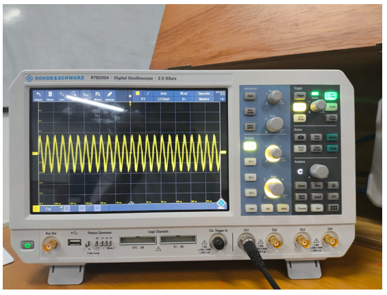            | 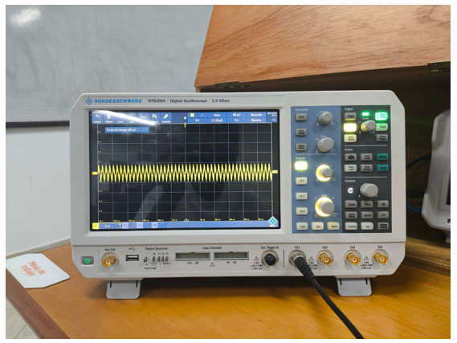                 |
  |-----------------|-----------------------|
  
- La forma de onda

  | 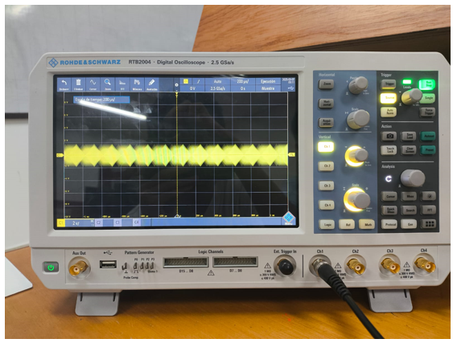            | 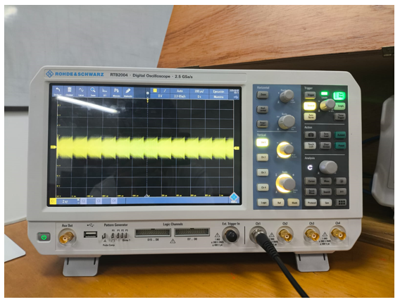                 |
  |-----------------|-----------------------|
  
- La frecuencia y fase de la señal

  | 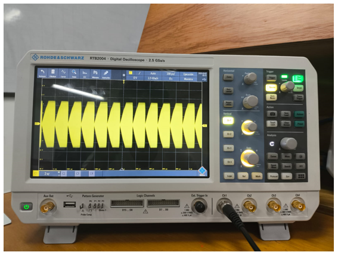            | 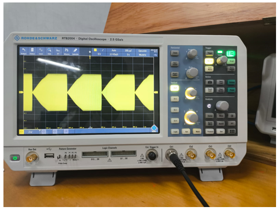                 |
  |-----------------|-----------------------|
  
- Efectos de modificar la amplitud de la señal generada.
  
  |             | 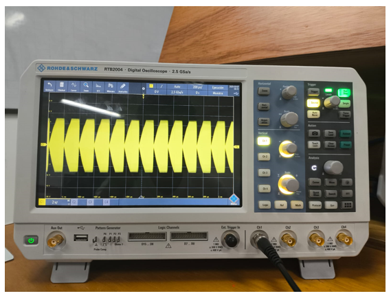                 |
  |-----------------|-----------------------|

### 4. Cálculo de la Relación Señal a Ruido (SNR):

Recordar que la relación señal a ruido (SNR): 

| Señal | Pseñal (dBm)                | Pruido (dBm) | SNR (dB) |
|-----------------|-----------------------| -----------------------|-----------------------|
| 90.7 MHz (W Radio) | -73.9 | -85 | 11.08 |
| Diente de sierra (Presentada anteriormente) | -48.34 | -85 | 36.66 |
| Seno (Presentada anteriormente) | -41.65 | -85 | 43.35 |
| Triangular (Presentada anteriormente) | -28.58 | -85 | 56.42 |

### Preguntas Orientadoras
#### 1. ¿Cómo se configura el USRP 2920 para transmitir una señal en una frecuencia específica?
Para transimitir una señal a una frecuencia específica es necesario conectar el cable de ethernet del pc a el USRP 2920, es necesario ejecutar y diseñar un diagramaen GNU radio y activar el bloque UHD:URSP Sink y con el deslizador de la frecuencia, ajustamos al valor deseado. (Es importante agregar una ganancia de transmisión ya que la señal podría perderse por el ruido que se pueda presentar en el canal)
#### 2. ¿Qué parámetros del flujograma afectan la potencia de la señal transmitida?
El parámetro "Tx gain in dB"
#### 3. ¿Cómo se mide el ancho de banda de la señal transmitida en el analizador de espectros?
Se debe presionar el boton "Mkr", a continuación se selecciona un marcador, luego se selecciona la opción "Marker Mode Marker 1" y finalmente en "N dB"
#### 4. ¿Cómo se calcula la relación señal a ruido (SNR) a partir de las mediciones de potencia y piso de ruido?
Dado que el analizador de espextros entrega las mediciones en dBm, la relación señal a ruido se puede calcular como: 
#### 5. ¿Qué diferencias se observan en las mediciones de potencia cuando se varía la ganancia del USRP?
La señal se atenúa considerablemente incluso si se reduce el parámetro "Tx gain in dB" a 0, la señal que se envía puede perderse ya que se mezcla con el piso de ruido.
#### 6. ¿Es posible medir o estimar la potencia de la señal observada en el osciloscopio? ¿Por qué?
No es posible porque el osciloscopio sólo ofrece valores de tensión (V) en el dominio del tiempo.
