# Práctica 1C: Mediciones de potencia y frecuencia

### Integrantes
- **DANILO ALEXANDER DURÁN MEJÍA** - 2210405
  
Escuela de Ingenierías Eléctrica, Electrónica y de Telecomunicaciones  
Universidad Industrial de Santander

### Fecha
03 de Marzo de 2025

---

## Actividad 1
### 3. Configuración de los Equipos
#### - USRP 2920:
#### -  Osciloscopio R&S RTB2004:

Escala horizontal: Mínimo 1 n/s y máximo 500 s

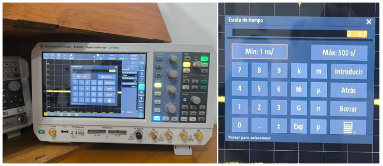

Escala vertical: Mínimo 10 mV y máximo 50 v

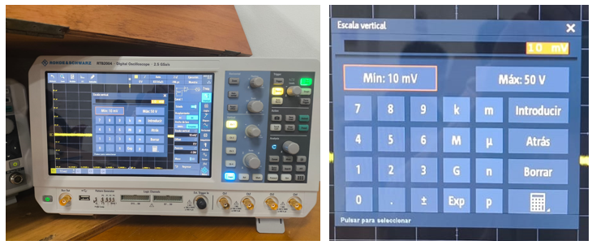

Mediciones verticales:

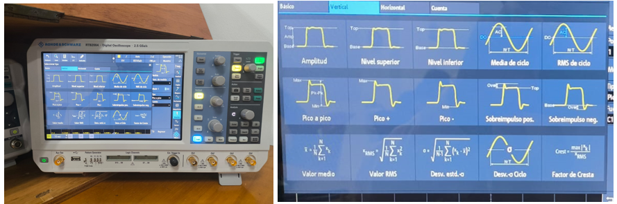

Mediciones de cuenta:

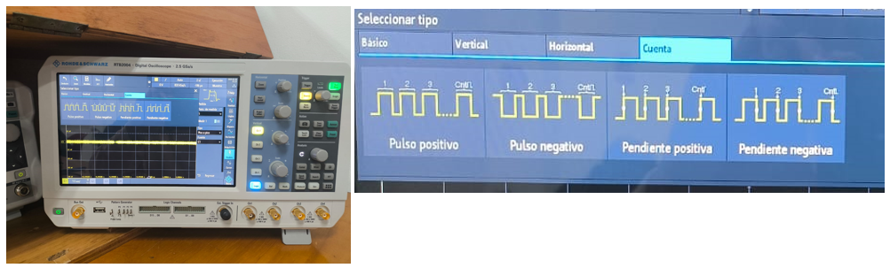

Mediciones básicas:

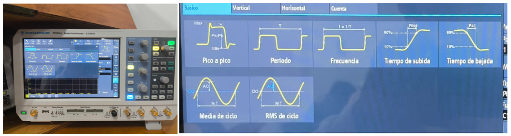

Mediciones horizontales:

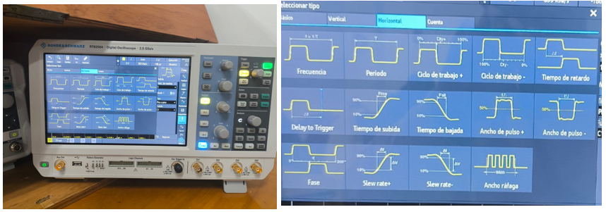

#### -  Analizador de Espectros R&S FPC1000:

Rango de frecuencia entre 5 kHz y 1 GHz

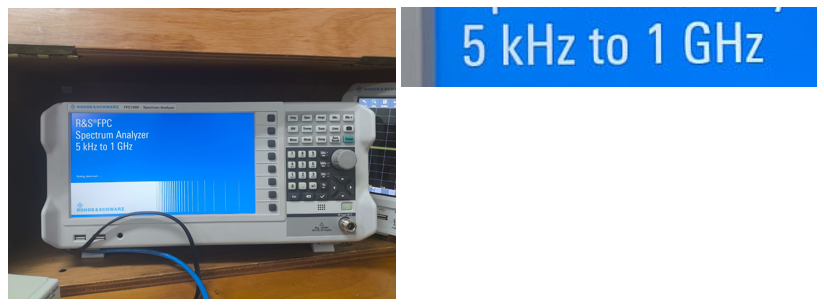

Resolución (RBW) mínima de 1 Hz y máxima de 3kHz

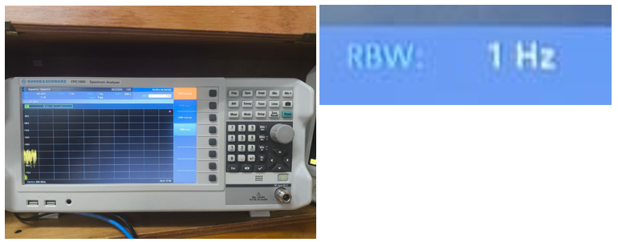
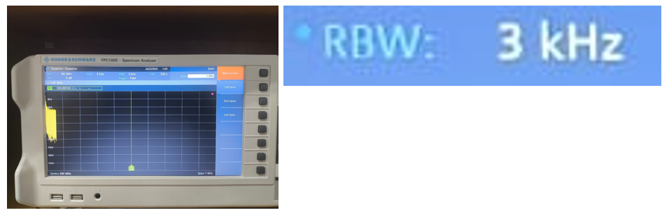

Figura de ruido:

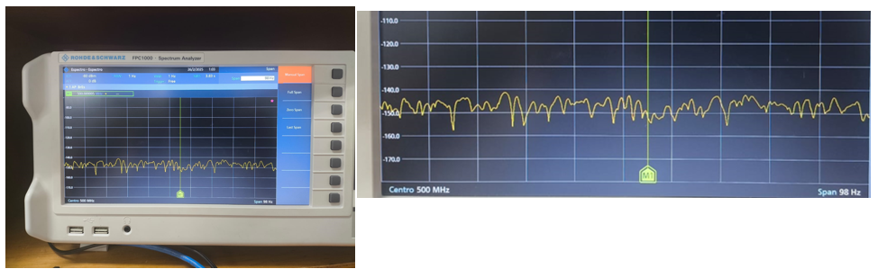

### Preguntas Orientadoras
#### 1. ¿Cuál es el rango de frecuencia del USRP 2920 y cómo se compara con el del analizador de espectros?
#### 2. ¿Qué parámetros del USRP 2920 se deben configurar para transmitir una señal en una frecuencia específica?
#### 3. ¿Cómo se configura el osciloscopio para medir la amplitud y la frecuencia de una señal?
Para medir la amplitud hacemos click en el botón de "Menu", luego en "Medida", luego seleccionamos tipo "Vertical" y damos click en el cuadro de "Amplitud".

Para medir la frecuencia hacemos click en el botón de "Menu", luego en "Medida", luego seleccionamos tipo "Básico" y damos click en el cuadro de "Frecuencia".
#### 4. ¿Qué diferencia hay entre medir una señal en el dominio del tiempo (osciloscopio) y en el dominio de la frecuencia (analizador de espectros)?
El osciloscopio me permite observar la señal tal cual es en el tiempo y poder realizar mediciones y conocer sus caracteristicas ya que puedo medir su amplitud, periodo, entre otros. Por otro lado, el analizador de espectros me permite observar cómo la energía de esa señal se distribuye a lo largo de las frecuencias permitiendome conocer el ruido y/o interferenias que se presenten en la señal.
#### 5. ¿Cómo se mide el piso de ruido en el analizador de espectros? ¿Cómo afecta la frecuencia central, SPAN y RBW la medida de piso de ruido? ¿Por qué?
El piso de ruido es el "ruido por defecto" que se puede apreciar en el analizador de espectros cúando hay ausencia de una señal de entrada tal y como se obseva en la [figura de ruido.png](https://github.com/SpikedRex/GNURADIO_LABCOMUIS_2025_1_B1C_G2/blob/main/practica_1/practica_1C/w9.PNG) presentada anteriormente. 

Cúando se tiene una frecuencia muy alta, el piso de ruido puede aumentar. Cúando el SPAN es más grande, el piso de ruido puede aumentar ya que se están incluyendo mas frecuencias por espacio. Un RBW alto puede elevar el piso de ruido debido a que más energía se acumula.

---

## Actividad 3
### 1. Configurar el USRP 2920:
Identifique el bloque de frecuencia de muestreo (samp_rate) y observe el efecto de cambiar su valor (e.g. 10 kHz).
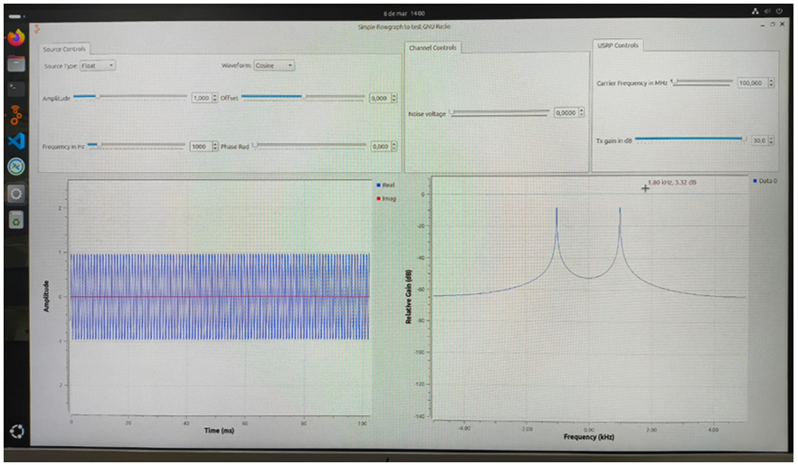

Configure la frecuencia de muestreo (samp_rate) en 1 MHz.
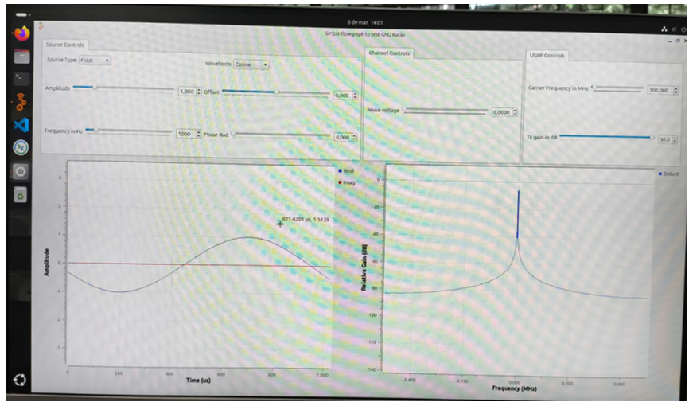

Es posible apreciar que al aumentar el samp_rate, esos dos picos que aparecían a 10 KHz "Desaparecen" (en realidad se hacen muy pequeños) esto debido a que muestrear con una frecuencia más alta, la resolución espectral aumenta permitiendo tener más información de más frecuencias.
