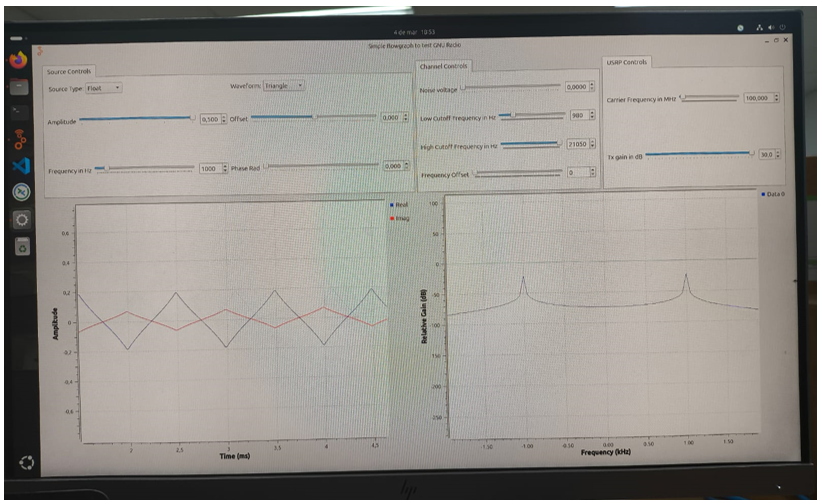
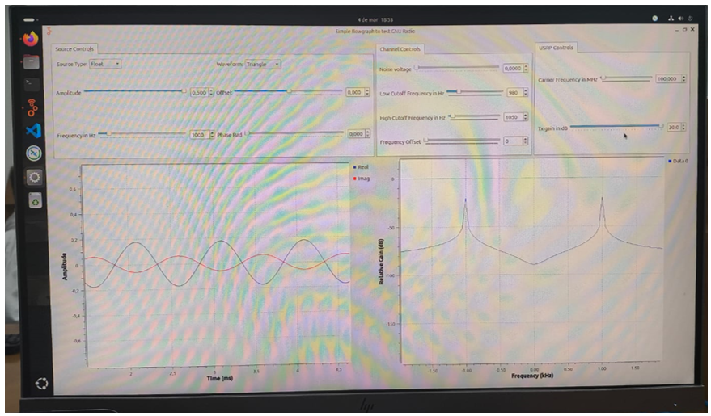
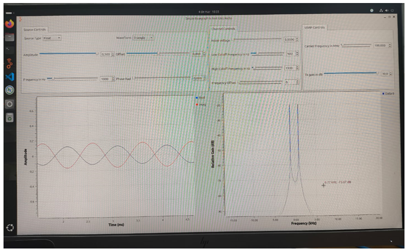
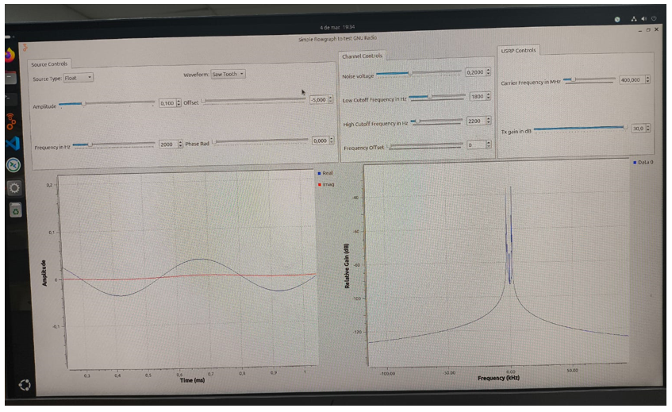
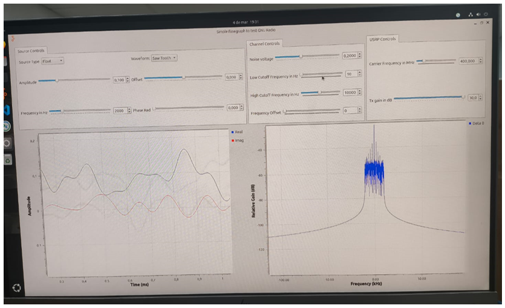
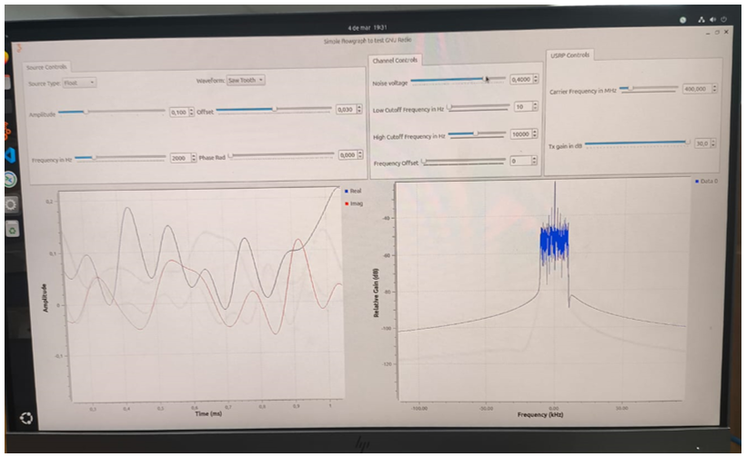
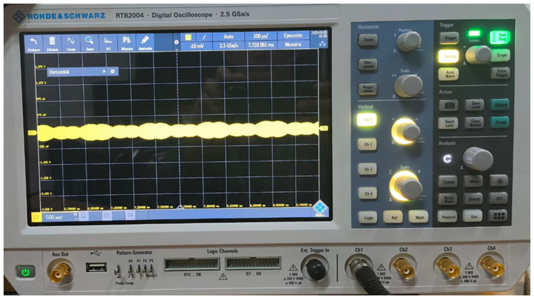
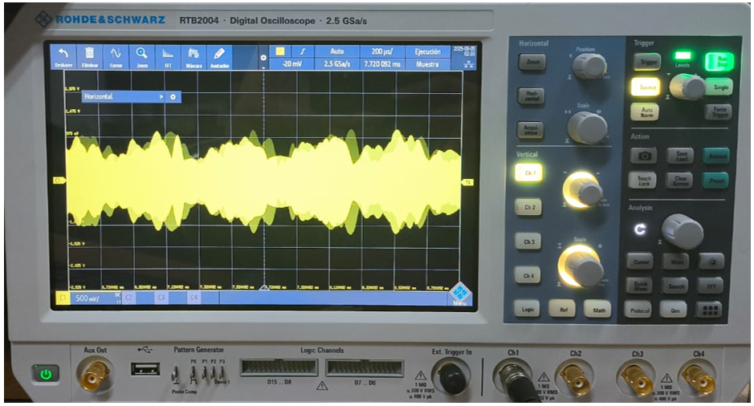
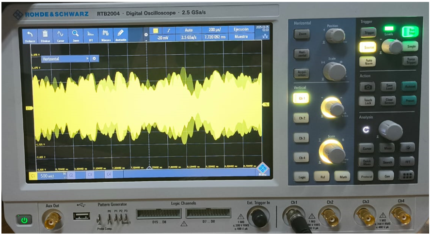

# Laboratorio de Comunicaciones
## Universidad Industrial de Santander
# Práctica 2A. Modelo de canal

### Integrantes
- **DANILO ALEXANDER DURÁN MEJÍA** - 2210405
  
Escuela de Ingenierías Eléctrica, Electrónica y de Telecomunicaciones  
Universidad Industrial de Santander

### Fecha
03 de Marzo de 2025

---

## Declaración de Originalidad y Responsabilidad
Los autores de este informe certifican que el contenido aquí presentado es original y ha sido elaborado de manera independiente. Se han utilizado fuentes externas únicamente como referencia y han sido debidamente citadas.

Asimismo, los autores asumen plena responsabilidad por la información contenida en este documento. 

Uso de IA:"Se utilizó ChatGPT para reformular secciones del texto, verificar gramática y automatización de código, pero el contenido técnico fue desarrollado íntegramente por los autores..

---
## Actividad 1: Actividades de simulación de canal en GNU Radio

### Procedimiento

**Simulación**
   - Verificar equipos y elementos a utilizar (revisar manuales de ser necesario)
   - Cargar el flujograma: [filters_flowgraph.grc](filters_flowgraph.grc).
   - Configurar siempre la frecuencia de muestreo (`samp_rate`) en $25e6/2^n$ Hz`, donde $n$ es un número entero mayor a 2.
   - Genere diferentes señales y observe el efecto de variar las frecuencias de corte del filtro.
   - Analice el efecto del ruido en el dominio del tiempo y la frecuencia para al menos dos formas de onda distintas.
   - Muestre con un ejemplo gráfico el umbral de máximo de ruido ante el cual considera que es posible recuperar cada forma de onda utilizando únicamente filtrado.

### Preguntas Orientadoras

- ¿Cuál es el efecto de filtrar las frecuencias altas de una señal?
  
| Señal original            | Señal con filtro aplicado                 |
  |-----------------|-----------------------|
  |             |                  |

  Es posible apreciar que al aplicar el filtro, la forma de la onda cambió ya que se ve una señal mucho más triangular lo que indica que las componentes de alta frecuencia han sido atenuadas y predominan las de menor frecuencia, este efecto tambíen puede ser apreciado en la grafica de frecuencia, en dónde el pico en 0 Hz aparece.
  
- ¿Qué sucede al filtrar muy cerca de la frecuencia fundamental de la señal?
  
| Señal original            | Señal con filtro aplicado                 |
  |-----------------|-----------------------|
  |             |                  |

  La ontra triangular toma una forma mucho mas suave y cercana a una senoidal, ademas, se puede apreciar en la gráfica de frecuencia, que las componenetes de frecuencia predominantes (Los picos) se ubican en la frecuencia fundamental.
  
- ¿Cuál es el efecto de filtrar las frecuencias bajas de una señal?

  | Señal original            | Señal con filtro aplicado                 |
  |-----------------|-----------------------|
  |             |                  |

  La ontra triangular toma una forma mucho mas suave y cercana a una senoidal, ademas, se puede apreciar en la gráfica de frecuencia, que las componenetes de frecuencia predominantes (Los picos) se ubican en la frecuencia fundamental.
  
- ¿Qué ocurre al eliminar armónicos de una señal?
- ¿Qué efecto tiene la desviación de frecuencia en la señal recibida? ¿Qué efecto(s) produce el filtro cuando la señal recibida se ve afectada por desviación de frecuencia?
- ¿Cómo cuantificar la degradación de la señal al aumentar los niveles de ruido?
- ¿Cómo se puede mejorar la relación señal a ruido en una señal?
- ¿Cómo podría cuantificar la calidad de la señal recibida? Considere el caso de señales analógicas y digitales.

## Actividad 2: Fenómenos de canal en el osciloscopio

### Preguntas Orientadoras

- ¿Cuál es el efecto del ruido sobre la amplitud de las señales medidas en el osciloscopio? ¿Conservan las mismas relaciones que se evidencian en la simulación?

  | Señal original            | Señal con ruido de 0.2                | Señal con ruido de 0.4                |
  |-----------------|-----------------------|-----------------------|
  |             |                  |                  |
    |             |                  |                  |

- ¿La relación señal a ruido creada intencionalmente en el computador se amplifica o se reduce en la señal observada en el osciloscopio?

- Demuestre ¿cómo se puede mejorar la relación señal a ruido en una señal?

- ¿Cómo se evidencia el fenómeno de desviación de frecuencia en el osciloscopio? Evidenciar al menos con dos formas de onda.
  
- Determine la afectación de un medio de transmisión coaxial (usar cables largos) sobre una señal periódica operando a las capacidades máximas de muestreo del USRP.
- 
  - **NOTA:** La frecuencia de transmisión no debe superar los 500 MHz para ser observada en el osciloscopio. Para el experimento, considere las relaciones de muestreo correspondientes.
- Usando cables coaxiales de diferentes longitudes, ¿cómo afecta la distancia entre el transmisor y el receptor a la amplitud de la señal medida?
- Usando antenas, ¿cómo afecta la distancia entre el transmisor y el receptor a la amplitud de la señal medida? ¿Es posible compensar el fenómeno?
- ¿Qué modelo de canal básico describe mejor las mediciones obtenidas en la práctica?
