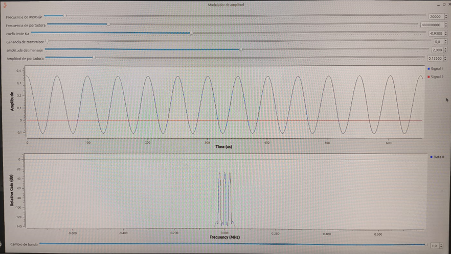
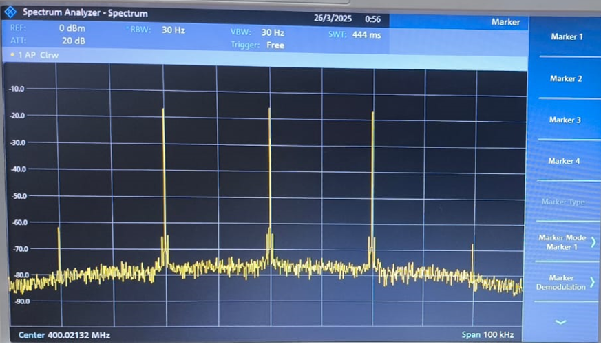
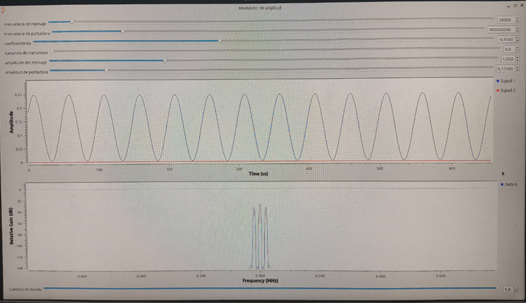
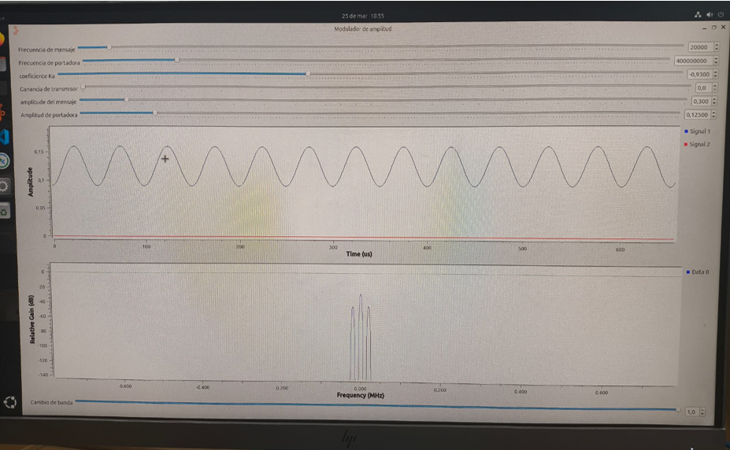

| Simulación GNU Radio | Analizador De Espectros | Potencia De La Señal Portadora | Potencia De La Banda Lateral Superior | Potencia De La Banda Lateral Inferior | Índice De Modulación | Frecuencia Del Mensaje | Relación Señal A Ruido Medida |
|-----------------|-----------------------| -----------------------| -----------------------|-----------------------|-----------------------|-----------------------|-----------------------|
|  |  | -17.27 dBm | -33.66 dBm | -33.61 dBm |  0.328 | 20 KHz | 62.73 dBm |
|  |  | -15.68 dBm | -22.11 dBm | -22.19 dBm |  0.945 | 20 KHz | 64.32 dBm |
|  |  | -15.72 dBm | -16.58 dBm | -16.62 dBm |  1.803 | 20 KHz | 64.28 dBm |
