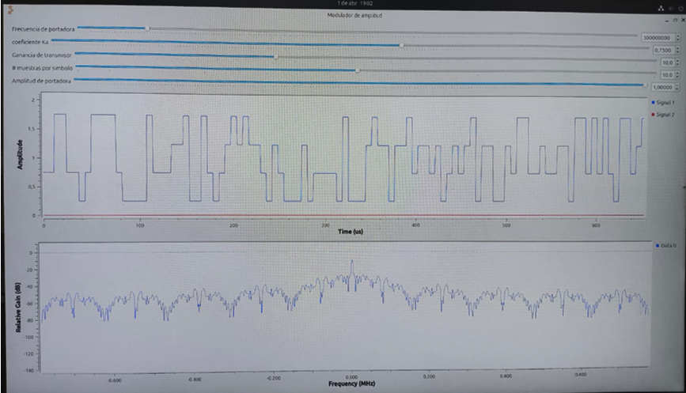
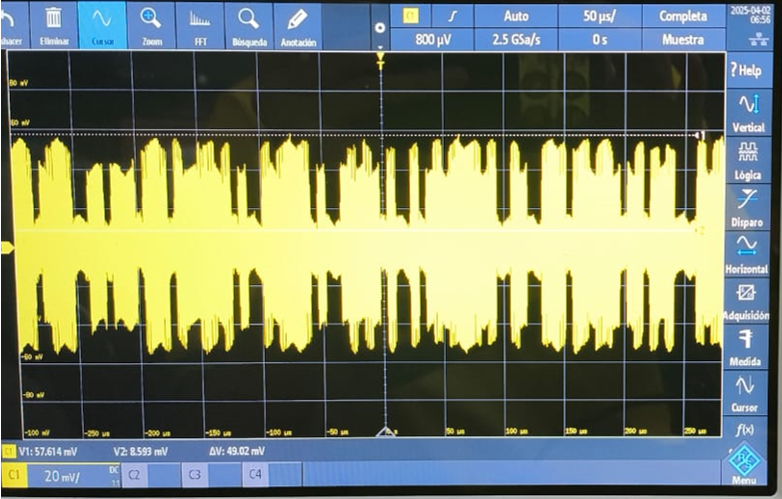
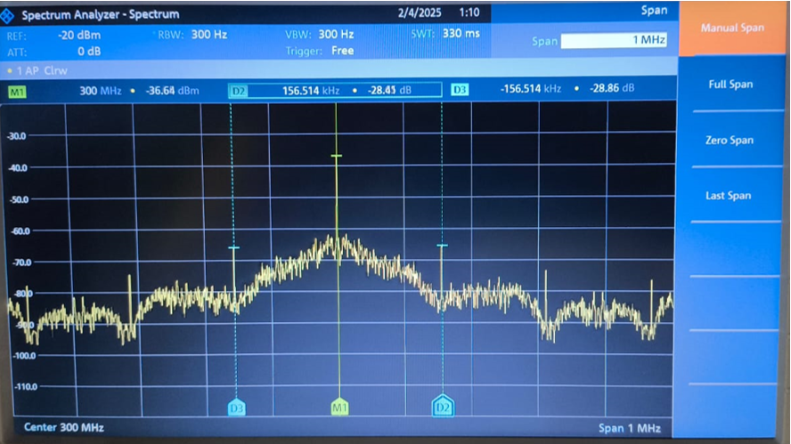
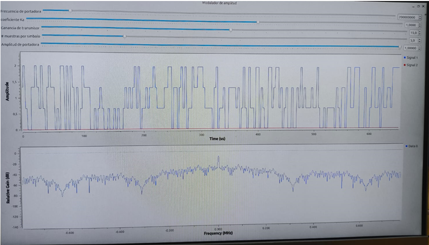
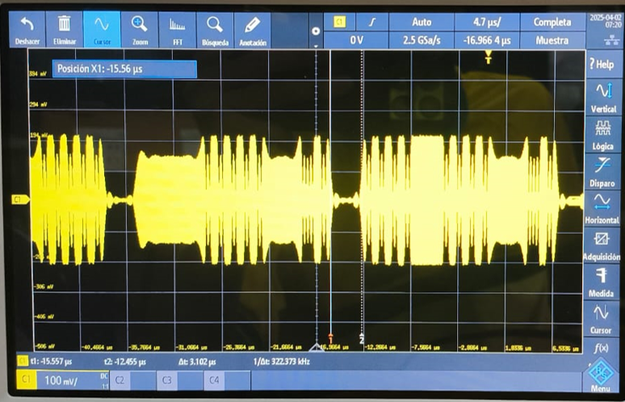
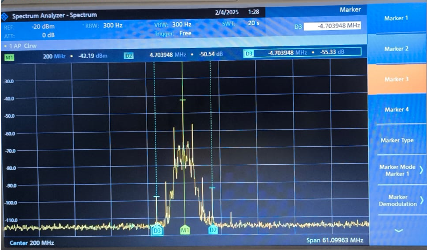
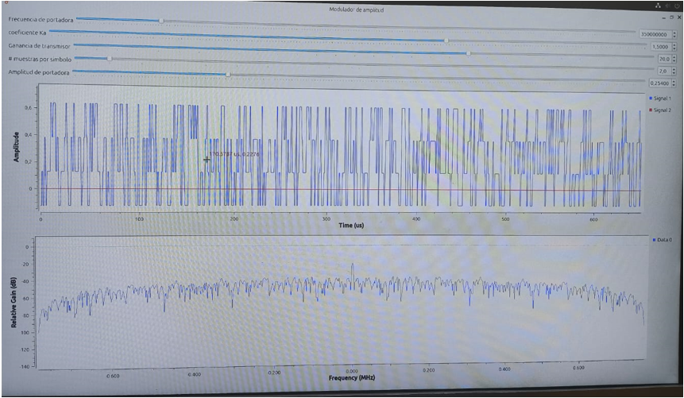
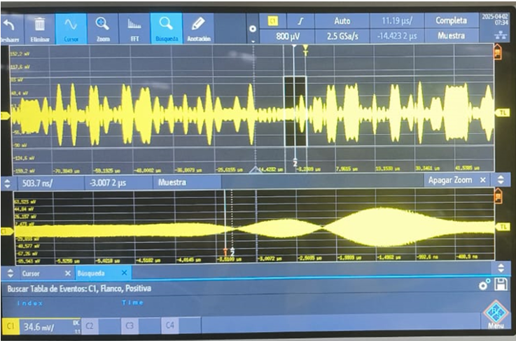

| Simulación GNU Radio | Osciloscopio | Analizador De Espectros | Tiempo de Bit | Índice De Modulación | Ancho de Banda de la Señal |
|-----------------|-----------------------| -----------------------| -----------------------|-----------------------|-----------------------|
|  |  |  |  | 0.714 |  313.028 kHz |
|  |  |  |  | 0.999 | 9.406 MHz |
|  |  |  |  | 115.126 |   |

| Simulación GNU Radio | Osciloscopio | Analizador De Espectros| Índice De Modulación | Ancho de Banda de la Señal |
|-----------------|-----------------------| -----------------------| -----------------------|-----------------------|
|  |  |  |  | 0.714 |
|  |  |  |  | 0.999 |
|  |  |  |  | 115.126 |

