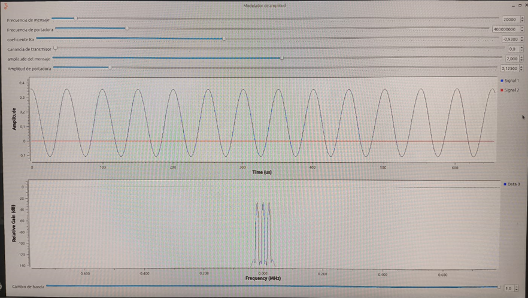
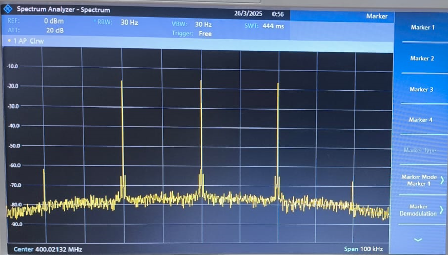
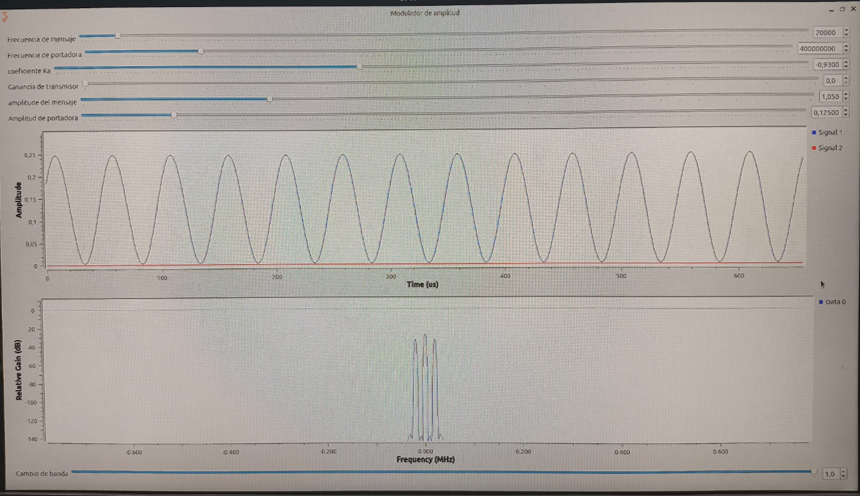
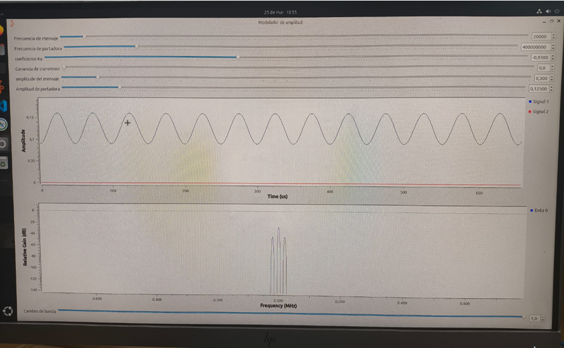
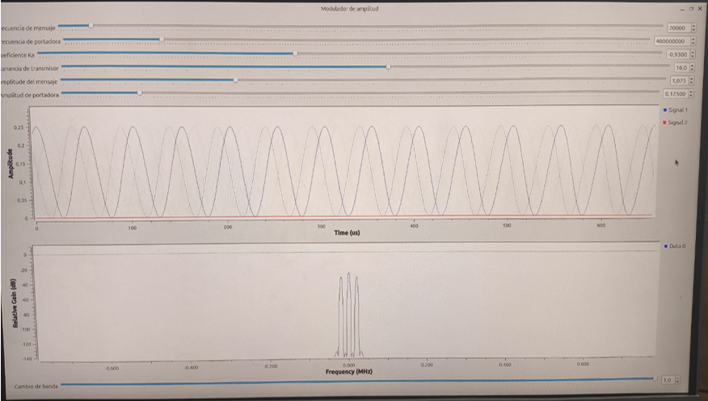
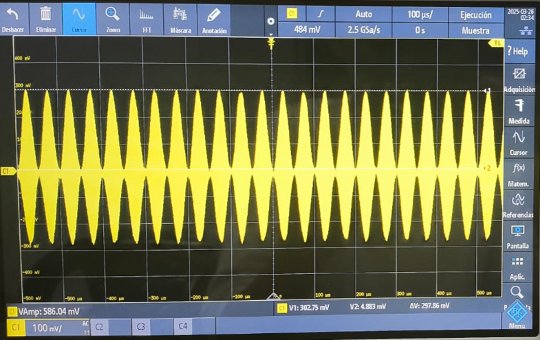
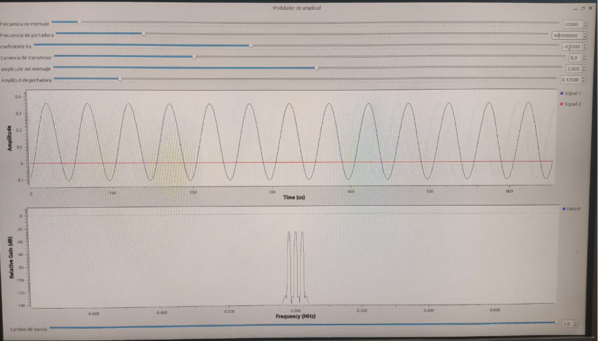
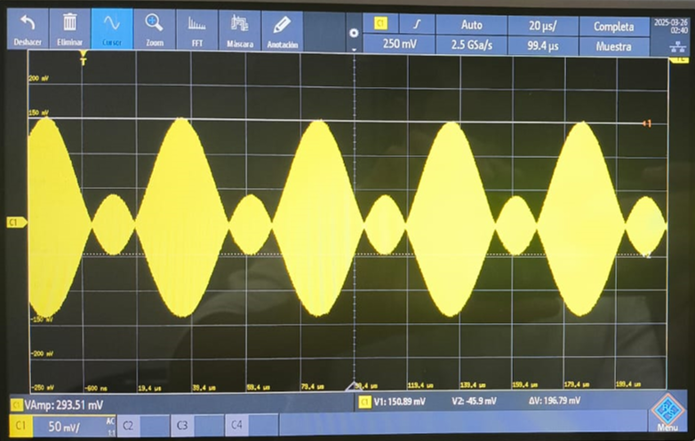
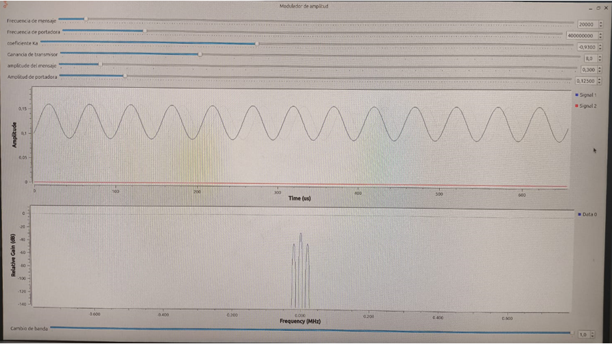
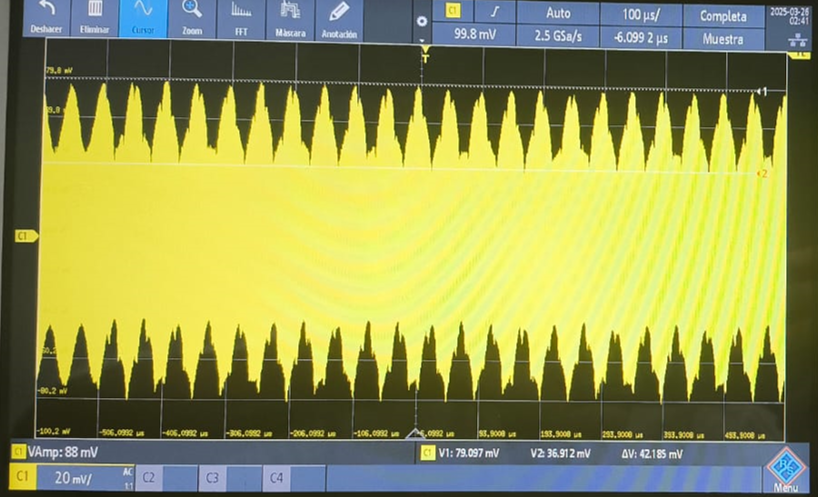

| Simulación GNU Radio | Analizador De Espectros | Potencia De La Señal Portadora | Potencia De La Banda Lateral Superior | Potencia De La Banda Lateral Inferior | Índice De Modulación | Frecuencia Del Mensaje | Relación Señal A Ruido Medida |
|-----------------|-----------------------| -----------------------| -----------------------|-----------------------|-----------------------|-----------------------|-----------------------|
|  |  | -17.27 dBm | -33.66 dBm | -33.61 dBm |  0.328 | 20 KHz | 62.73 dBm |
|  |  | -15.68 dBm | -22.11 dBm | -22.19 dBm |  0.945 | 20 KHz | 64.32 dBm |
|  |  | -15.72 dBm | -16.58 dBm | -16.62 dBm |  1.803 | 20 KHz | 64.28 dBm |

| Simulación GNU Radio | Osciloscopio | Amplitud De La Señal Portadora | Amplitud Del Mensaje | Potencia De La Señal Con Los Valores De Amplitud Medidos | Índice De Modulación Medido En El Osciloscopio | Frecuencia Del Mensaje |
|-----------------|-----------------------| -----------------------| -----------------------|-----------------------|-----------------------|-----------------------|
|  |  | 153.8165 mV | 148.9335 mV | 122.9 MW |  0.968 | 20 KHz |
|  |  | 52.48 mV | 98.38 mV | 23.404 MW |  1.874 | 20 KHz |
|  |  | 58.0045 mV | 21.0925 mV | 50.18 KW | 0.36 | 20 KHz |

## **Anexos**
- Archivo de Simulación en GNU Radio usado: [`Practica3.grc`](https://github.com/SpikedRex/GNURADIO_LABCOMUIS_2025_1_B1C_G2/blob/main/practica_3/Modulaciones lineales/Practica3.grc)
