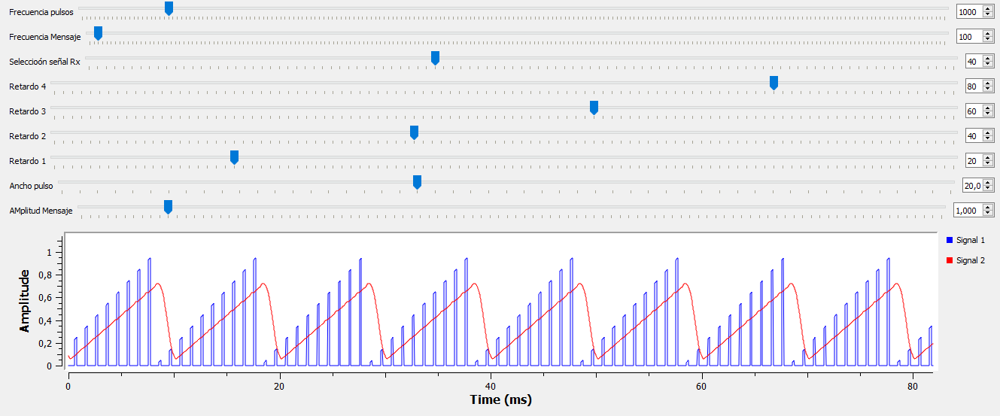
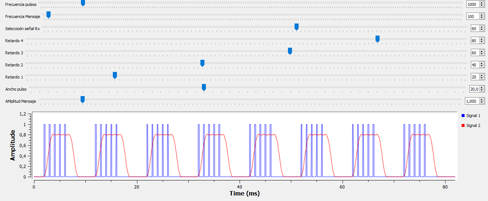

| Señal a recuperar | Retardo señal Rx (ms) | Evidencia                  |
|-------|--------------|--------------------------------|
| Diente Sierra    | 40           ||
| Cuadrada    | 60           ||

| Señal a recuperar | Retardo señal Rx (ms) | Simulación                  | Osciloscopio                  | Analizador de espectros                  |
|-------|--------------|--------------------------------|
| Senoidal    | 0           ||
| Cuadrada    | 60           ||

